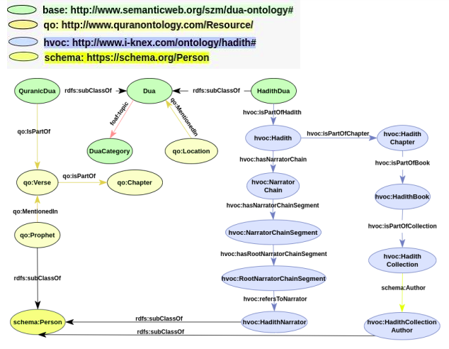

This project aims at building an ontology and knowledge graph by linking two Islamic datasets, namely Quran and Hadith Ontologies, and their vocabularies. The dataset was converted to OWL and validated with SPARQL queries.

The main class for our Dua Ontology was the Dua class, with subclasses QuranicDua and HadithDua.

The QuranicDua class contains information about the Quranic verses and mentioned prophets, while the HadithDua class contains information about the narrator of the Hadith including the narrator chain up till the root narrator, and its reference.

